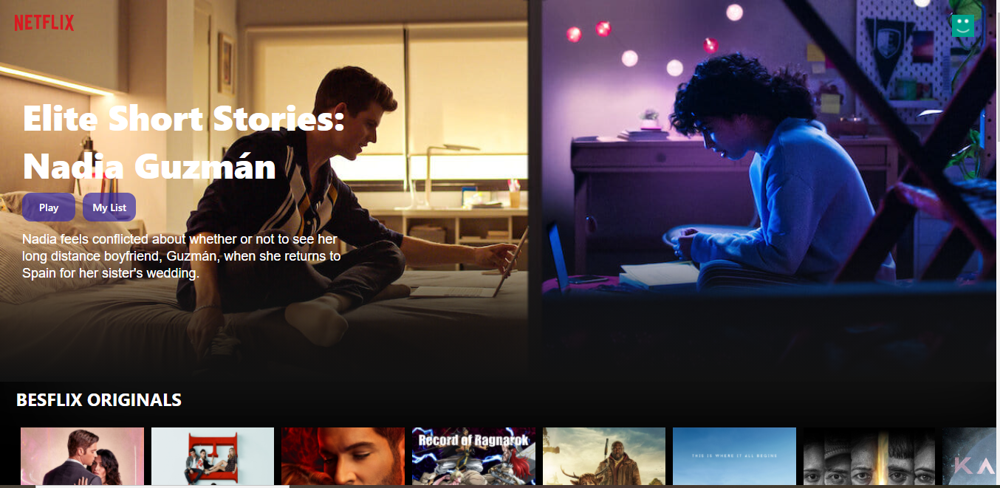

# Besflix

## _This is a Netflix Clone web App built with Reactjs_

This project was created with the intent to mimic the Original Netflix (https://Netflix.com)

## Live SIte

(https://besflix-react.web.app/)

## All the movie data were pulled with Axios from themoviesdatabase.org (TMDB)

- Powered by
  
  TMDb offers a powerful API service that is free to use as long as you properly attribute us as the source of the data and/or images you use).

### Screen Shots

### Built with

- CSS custom properties
- Flexbox
- CSS Grid
- Mobile-first workflow
- React Hooks
- Context API
- [React](https://reactjs.org/) - JS library

## To Clone this This project

simple go to my github repo page (kingbaddo
/
besflix) and download the file and download all dependencies or Clone the Repo directly

## This Web App is hosted using firebase hosting services

The web app was deployed to firebase

### `npm run build`

Builds the app for production to the `build` folder.\
It correctly bundles React in production mode and optimizes the build for the best performance.

The build is minified and the filenames include the hashes.\
Your app is ready to be deployed!

See the section about [deployment](https://facebook.github.io/create-react-app/docs/deployment) for more information.
